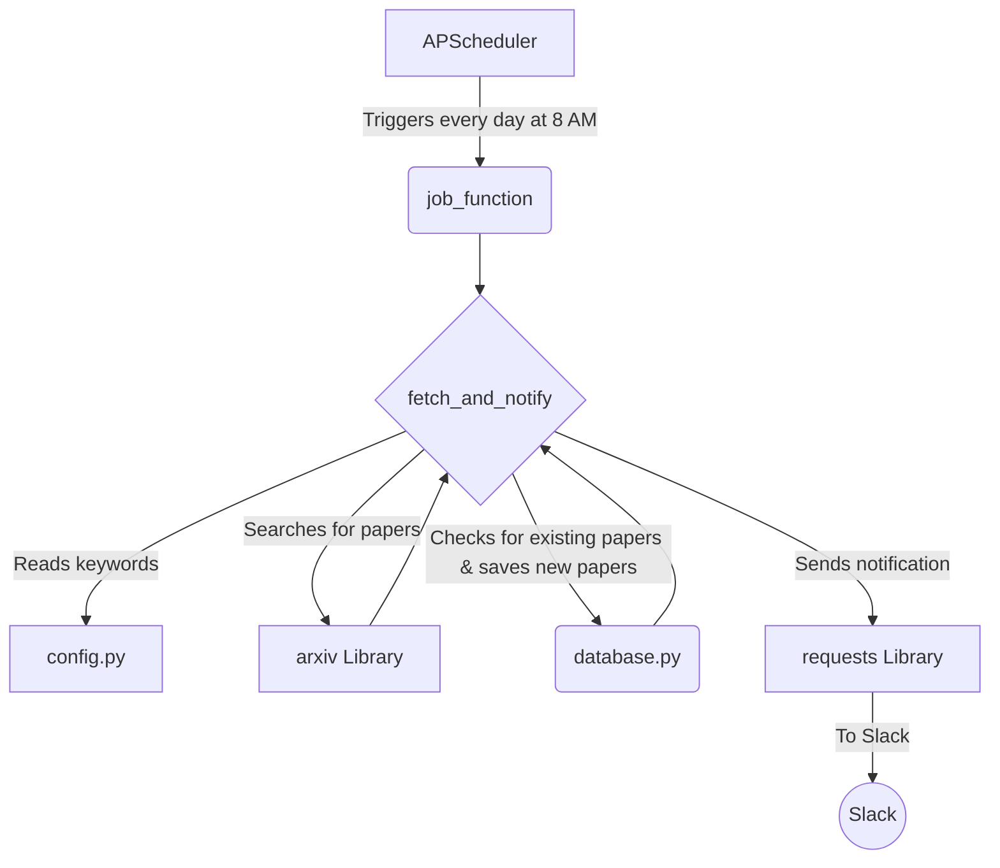

# Data Flow Diagram

This document explains the data flow of the automated paper collection and notification agent. The diagram below illustrates the sequence of operations, and the subsequent sections provide a detailed explanation of each step.

## Explanation of the Data Flow

1.  **Scheduler (APScheduler)**
    *   The process starts with the `APScheduler`, which is a scheduling library. It is configured to automatically trigger the `job_function` at a specific time every day (in this case, 8:00 AM).

2.  **Job Function (`job_function`)**
    *   This function acts as the main entry point for the scheduled task. Its primary role is to call the `fetch_and_notify` function, which contains the core logic of the application.

3.  **Fetch and Notify (`fetch_and_notify`)**
    *   This is the heart of the application. It orchestrates the entire process of fetching, storing, and notifying.

4.  **Configuration (`config.py`)**
    *   The `fetch_and_notify` function begins by reading the `config.py` file. This file contains important settings, such as the keywords to search for and the Slack webhook URL for sending notifications.

5.  **arXiv Library**
    *   Using the keywords from the configuration, the application interacts with the `arxiv` library to search for recent papers on the arXiv.org website.

6.  **Database (`database.py`)**
    *   For each paper found, the application checks the `papers.db` database (managed by `database.py`) to see if the paper has already been saved. This is done to avoid sending duplicate notifications.
    *   If a paper is new, its details (title, authors, abstract, etc.) are saved to the database.

7.  **Requests Library**
    *   If any new papers were found and saved to the database, the `fetch_and_notify` function then uses the `requests` library to send a notification to the configured Slack channel.

8.  **Slack**
    *   Finally, the notification, containing the titles and links to the new papers, is delivered to your Slack workspace.